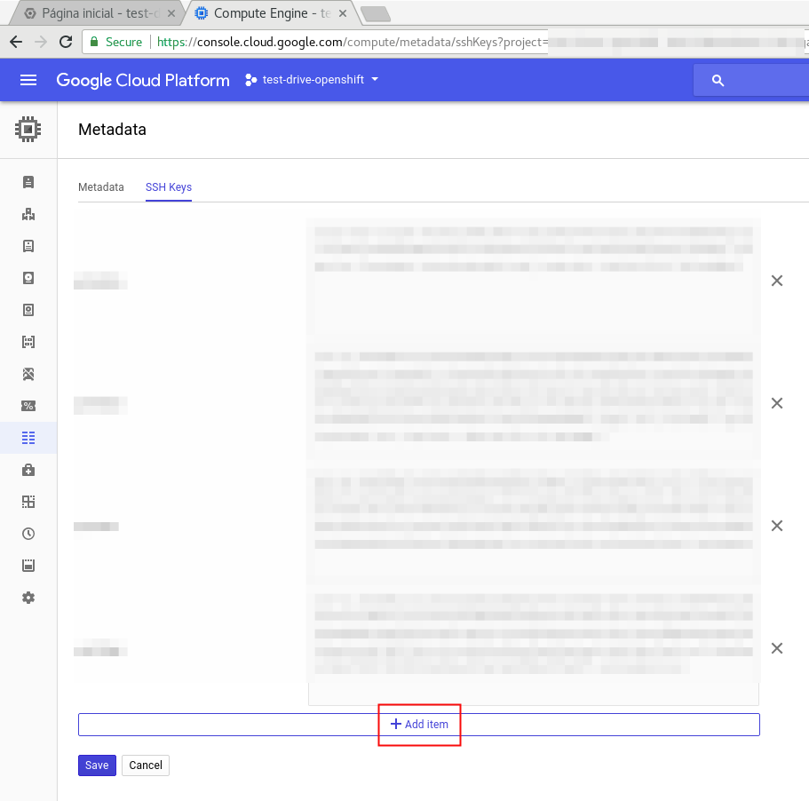

# Workshop Onboarding #

O Workshop Onboarding é uma plataforma desenhada para facilitar a realização de workshops através de uma aplicação de onboarding.

Esta aplicação é composta de:

- Interface Web personalizada para cada estudante
- Etherpad dinâmico (baseado no nome do workshop)
- Documentação para Workshop de Openshift e ansible
- Documentação para Ansible personalizada
- Solução para Terminal (Console) no Browser
- Link para Formulário de Feedback do Workshop

## Pre-requisitos ##

* Conta em Google Cloud Compute Engine
* Cluster (ou OC Cluster UP) Openshift de Apoio
* Conta Gmail para o envio de e-mail
* Binario OC presente na maquina que ira executar o playbook (em /usr/local/bin/oc)
* (Opcional) Ansible Tower para o caso de workshops com Ansible Tower

### Como utilizar? ###
Etapas:

1 - Criar a conta no Google Cloud
2 - Criar projeto Wetty no Openshift de Apoio
* É possível utilizar o wetty do Cluster Sas-Brazil presente em http://wetty-rhbrlab-workshop-apoio.apps.paas.rhbrlab.com/. Login workshop, senha workshop.

3 - Copiar a chave publica do usuario workshop para seu projeto no Google.

4 - Editar o arquivo config.yaml com as suas variaveis (Ex: credenciais do google, email, project-id e etc)

5 - Rodar o playbook de acordo com a tecnologia do workshop
Para Openshift:
ansible-playbook create_student_instance.yml

Para Ansible:
ansible-playbook create_student_instante_ansible.yml

Para subir um OC Cluster UP de Apoio
ansible-playbook create_clusterup_apoio.yml

PS: Atentar para o nome do aluno unico por workshop. Usar apenas caracteres alfa-numericos.

### Todo ###

* Criacao de playbook para carregar por CSV
* Criacao de instancias com chaves especificas para cada aluno
* Adaptar a aplicacao de onboarding para executar em um unico container (a pensar)
* Acrescentar este Readme com instrucoes para Workshop de Ansible.
* Utilizar um wetty para cada aluno
