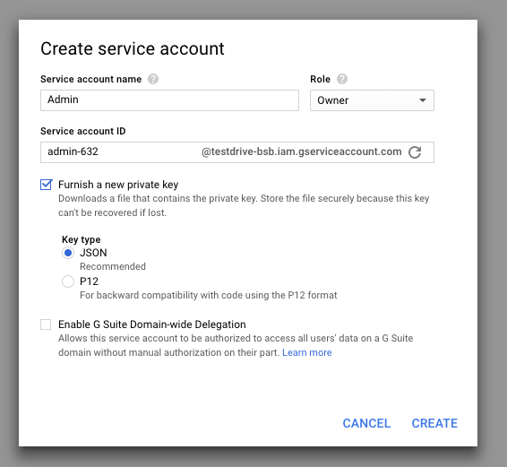
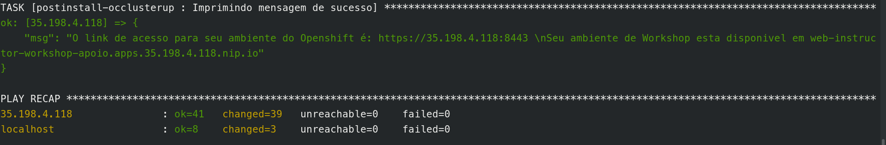
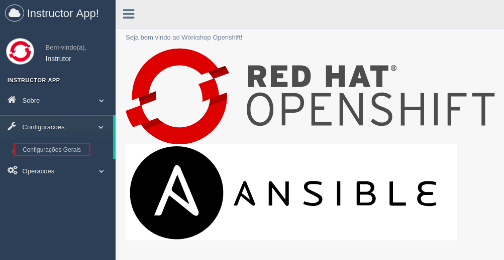

# Workshop Onboarding #

O Workshop Onboarding é uma plataforma desenhada para facilitar a realização de workshops através de uma aplicação de onboarding para os estudantes e também para o instrutor.


Dentre os vários recursos criados, duas aplicações merecem um destaque:

* Aplicação de onboarding do aluno
* Aplicação de onboarding do instrutor

## Benefícios

* Tempo reduzido de setup do ambiente;
* Ambiente padronizado;
* Menor quantidade de requisitos de hardware e software;
* Personalização do workshop para cada cliente;
* Feedback instantâneo;
* Fácil acesso a documentação dos workshops;
* Acesso as labs simplificado e sem necessidade de liberação de firewall;
* Facilidade de uso para o instrutor;
* Métricas de uso do workshops.

## Como Funciona?

O instrutor executa um playbook que cria uma instância no Google Cloud contendo um cluster do Openshift já com as aplicações necessárias para o funcionamento do test drive. Quando executado, esse playbook:
1. Cria instancia de servidor virtual no google cloud;
2. Instala o Openshift nesse servidor virtual;
3. Instala a aplicação do instrutor;
4. Instala a aplicação de sorteio;
5. Instala o wetty (Terminal via Web Console);
6. Instala o etherpad.

Depois de finalizado o playbook, o estudante pode provisionar as suas instâncias no Google Cloud e sua área de trabalho (apps de onboarding do aluno) por meio de um formulário (self service):


Depois de preenchido o formulário, o aluno recebe um email com acesso a aplicação de onboarding do estudante.

Essa aplicação é composta de:

1. Interface Web personalizada para cada estudante
2. Etherpad dinâmico (baseado no nome do workshop)
3. Documentação para Workshop de Openshift e Ansible
4. Solução para Terminal (Console) no Browser
5. Link para Formulário de Feedback do Workshop


## Pre-requisitos ##

* Conta em Google Cloud Compute Engine;
* Conta Gmail para o envio de e-mail;
* Ansible com apache-libcloud;
* (Opcional) Ansible Tower para o caso de workshops com Ansible Tower.

## Como utilizar? ###
Etapas:

1. Criar a conta no Google Cloud e configurar permissões





2. Copiar a chave pública do seu usuário para seu projeto no Google.


3. Clone esse repo

```
git clone https://github.com/redhat-sa-brazil/workshop-onboarding.git
```

4. Editar o arquivo config.yaml com as suas variaveis (Ex: credenciais do google, email, project-id e etc)

```
credentials_file: /path/para/json_gce/test-drive-openshift-8308925.json
chave_ssh: /home/user/.ssh/gce_id_rsa
usuario_ssh_gce: user
nome_projeto_openshift: workshop
email_remetente: your-email@gmail.com
```

5. Rodar o playbook `create_clusterup_apoio.yml`
```
ansible-playbook create_clusterup_apoio.yml
```

6. Configurar dados adicionais por meio aplicação do instrutor.

A URL de acesso é informada assim que o playbook do passo 5 estiver finalizado sua execução.



No meu caso, a URL é `web-instructor-workshop-apoio.apps.35.198.4.118.nip.io`.

Depois de aberto, logue com `admin` e senha `redhat`.


Acesse as configurações gerais:


Informe os valores necessários conforme explicação abaixo:


1. Usuário do Google Cloud (ver arquivo config.yml)
2. Email utilizado para envio das informações de cada estudante 
3. Senha do email
4. Link de uma formulário do Google Forms para coleta das avaliações do Workshop. Utilizamos por enquanto esse aqui: https://docs.google.com/forms/d/1avbPS9gCmXl-_CD55mb73Rejf-mDffFc3EsuR9hfsf0

> OBS: O Google Cloud limita a quantidade de vCPUs e IPs por projeto. O valor padrão pode ser visto em `IAM e Admin` -> `Cota`. Confira antes a quantidade de alunos e evite problema com as cotas.


### Todo ###

* Acrescentar este README com instruções para Workshop de Ansible;
* Geração de chave ssh automática;
* Criar aplicação de perguntas e respostas;
* Criar aplicação para correção dos laboratórios e desempenho do aluno;
* Envio de artefatos utilizados por email ao final do test drive;
* Perguntar senha da app do instrutor no inicio da execução do playbook `create_clusterup_apoio.yml`;
* Reestruturação em mais roles no playbook `create_clusterup_apoio.yml`;
* Ajustes/troca do layout/design.

